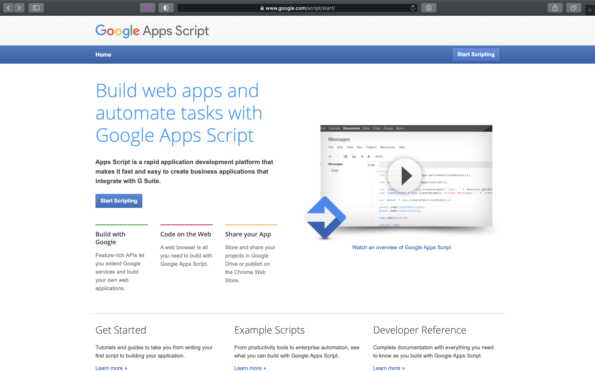
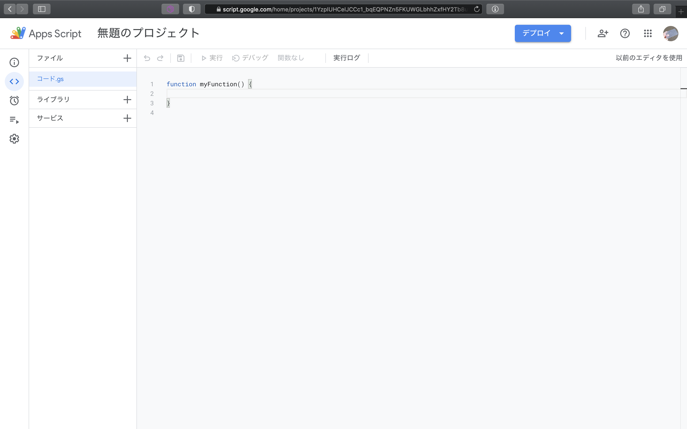

# プロジェクトの作成・実行

[< Previous](01_Overview.md) [Home](00_Indices.md) [Next >](03_ExecFunc.md)

## Google Apps Scriptへのサインイン

まずは [Google Apps Scriptにサインイン](https://script.google.com)します。

「Start Scripting」をクリックし、自分のアカウントでサインインします。

**注意:** ここでサインインに使用したアカウントを使用してメールを送信したり、スプレッドシートを操作することになります。開発用のアカウントを持っている場合はそちらを使用するべきでしょう。

## プロジェクトの作成

サインインすると、このような画面に遷移します。これがいわゆる「ダッシュボード」にあたります。プロジェクトの管理や設定、リファレンス等はここから閲覧できます。

今回は新しくプロジェクトを立てるので、「新しいプロジェクト」をクリックします。

「無題のプロジェクト」という名称のプロジェクトが生成されました。ここの名前は適宜変更しておいてください。  
今回は「GASExampleProj」としました。

[< Previous](01_Overview.md) [Home](00_Indices.md) [Next >](03_ExecFunc.md)
