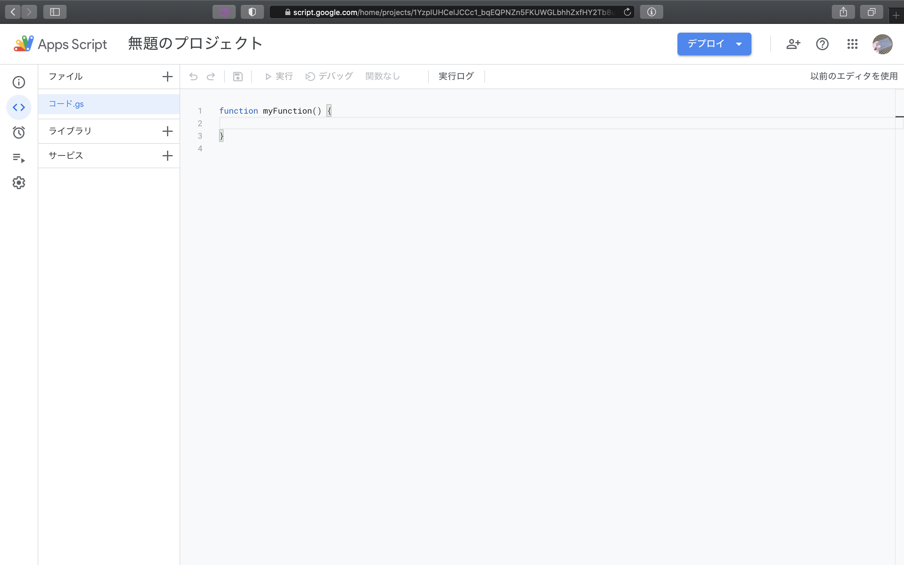

# 関数の実行

[< Previous](02_CreateProject.md) [Home](00_Indices.md) [Next >](04_DefAppClass.md)

## ごあいさつ

シートの自動化、フォームの自動集計、メールの管理…  
もろもろに飛びついていきたいところですが、まずはGASに挨拶をしておきましょう。  
こういうところの一手間が、自分のプロジェクトへの愛着につながります(適当)。

…さて、新しくプロジェクトを作成すると 空の関数`myFunction`が生成されていることがわかります。  

GASは「関数」を一つの実行単位として扱うので、諸々の処理は**とりあえず**この関数の中に書いていくことにします。

処理が記述できたら「実行」をクリックします。  
(今回は普通に`console.log`を使用しましたが、どうやらGASでは`Logger.log()`も使用できるようです。`getLog`メソッドもあるようなので`Logger`の方がいいかもしれません。)  

**こんにちは、Google Apps Script!**

## 複数の関数を定義する

関数は1ファイル内にいくつでも置いておくことができます。

*myFunction*をクリックすると関数の一覧が開くので、そこから実行したい関数を選択し「実行」します。

二つ目の関数も実行することができました。

[< Previous](02_CreateProject.md) [Home](00_Indices.md) [Next >](04_DefAppClass.md)
