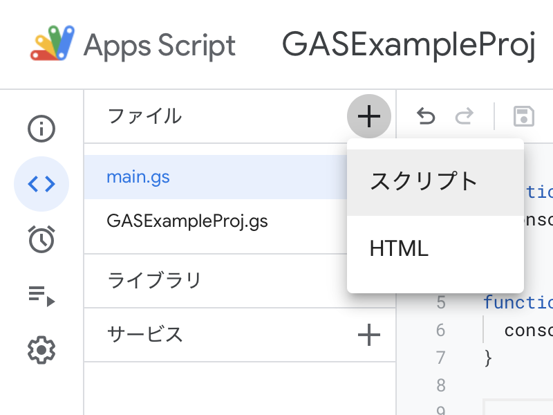

# アプリケーションクラスの設定

[< Previous](03_ExecFunc.md) [Home](00_Indices.md) [Next >](05_EditForms.md)

## 関数の分割とエントリポイントの整理

このまま`myFunction`をCでいう`main`のように使ってもいいのですが、個人的に**それはちょっとうーん**というところがあります。
後々処理内容を振り分けることを考えると、アプリケーションのエントリポイント(最初に実行される部分)とスクリプト本体(ロジック周りの処理)は完全に分割してしまった方が拡張性が維持できる気がします。

### ファイル追加

いくつかファイルを追加します。デフォルトで存在する`コード.gs`は削除してしまっても構いません。

 - `main.gs` (エントリポイント)
 - `{プロジェクト名}.gs` (アプリケーション本体)

ファイルは左上の「+」->「スクリプト」から追加できます。**このとき`.gs`をつける必要はありません**(自動で付加されます)。



各ファイルの構成は以下の通りです:

**main.gs**

```js
//
// main.gs
// GASExampleProj
//
// @2021 EncahtCode.
//

// Application entrypoint (on boot by source editor)
function __enrtyPoint(){
  const application = new GASExampleProj();
  application.main();
}
```

**GASExampleProj.gs**

```js
//
// GASExampleProj.gs
// GASExampleProj
//
// @2021 EncahtCode.
//

class GASExampleProj {

  //
  constructor(){
    // ...
  }

  // Application main
  main(){
    console.log("Hello, Google Apps Script!");
  }

}
```

`main.gs`の`__entryPoint`関数を実行すると`GASExampleProj::main`が実行されます。この関数がアプリケーションのメイン部分となります。

[< Previous](03_ExecFunc.md) [Home](00_Indices.md) [Next >](05_EditForms.md)
