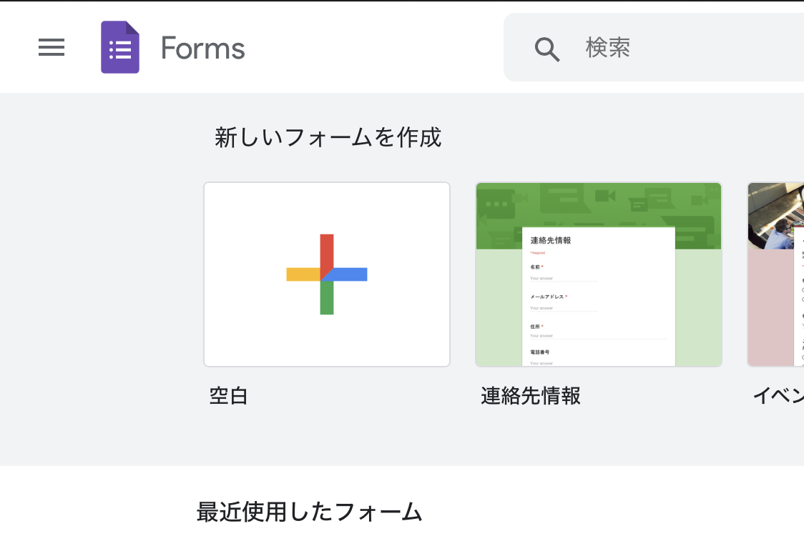
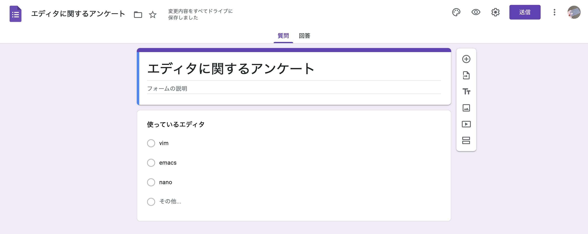
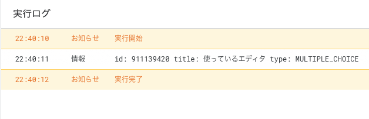
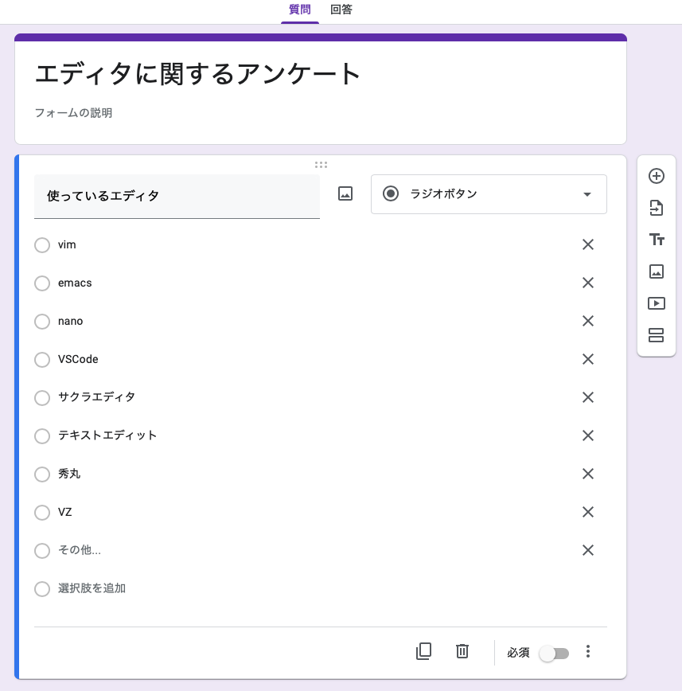
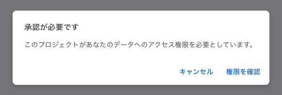
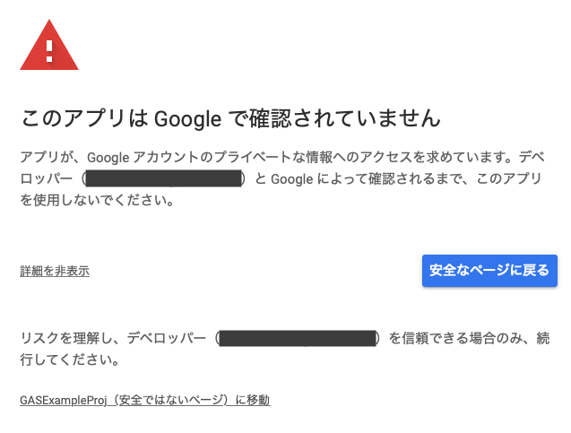

# Googleフォームを編集する

[< Previous](04_DefAppClass.md) [Home](00_Indices.md) [Next >](06_EditSheet.md)

## 諸君　私は自動化が好きだ

人間は「怠惰な生き物」といわれます。古来より人類は「いかに効率的に機械を動かすか」ということに心血を注いできました。  
蒸気機関に始まり、電気、化石燃料、原子力、インターネット…  

そしていま、我々は新たなフロンティアへと向かっています。

*Automation - 自動化* の未来を目指して。

(こういうのが好きな方向け: [Twitter](https://twitter.com/i/events/1184149237660966912?s=20))

## 厨二感溢れる前置き

**意味不明な前置き**は置いておきましょう。本項では[Googleフォーム](https://docs.google.com/forms)を自動化していきます。

まずは自動化の基盤となるフォームを生成します。



「空白」を選択し、適当に質問を設定しておきましょう。



**いい感じに炎上しそうな**アンケートができました。  
「送信」->「⊂-⊃」->「コピー」をクリックし、どこかに保存しておきましょう。
今回はこのようなURLが生成されました:

```
https://docs.google.com/forms/d/e/1FAIpQLSdIGzpY21j9UkVD5g-ra6dspTTPgw4daRATbpruqozrhdI45A/viewform
```

## 選択肢を追加する

このフォーム、現時点ではVSCode使いやサクラエディタ使いに優しくありません。「俺たちゃ『その他』だってのか!?」という**ご指摘**が飛んできてしまいます。  
しかし、大量のエディタ項目を人力で追加するのは少々面倒です。**面倒なことはGASにやらせましょう。**

まず、フォームの編集ページのURLをコピーします。このURLには識別子が埋め込まれており、これをGASに渡すことでフォームをGASからいじれるようになります。

```
https://docs.google.com/forms/d/(この部分が識別子です)/edit
```

```js
// Application main
main(){
    // 識別子を指定してフォームを開く
    const formID = "XXXXXXXX";
    const form = FormApp.openById(formID);

    // フォームの項目を取得
    const items = form.getItems();
    items.forEach((item) => {
        // itemの情報を表示
        const id = item.getId();
        const title = item.getTitle();
        const type = item.getType();
        
        console.log(`id: ${id} title: ${title} type: ${type}`);
    });
}
```

このコードを実行すると、フォームに含まれる項目を一覧で取得することができます。(テスト用に作ったフォームなので一項目しかありませんが…)  



ここに項目を追加していきます。実行結果より、今回のアイテムについては

 - id: 911139420
 - type: MULTIPLE_CHOICE

ということがわかっているため、

まず`getItemById()`を使って項目を取得し、それを`asMultipleChoiceItem()`を使って`MultipleItem`に変換し、`getChoices`, `setChoices`で選択肢を取得・設定する

…というフローで書いていけば良さそうな気がします。~~徐々に適当になってきました。~~

(`asMultipleChoiceItem()`は例外を投げうることに注意してください。)


```js
// Application main
main(){
    // 識別子を指定してフォームを開く
    const formID = "XXXXXXXX";
    const form = FormApp.openById(formID);

    // IDを指定して
    const targetItemID = "911139420";
    try{
        // 項目を持ってくる
        const targetItem = form.getItemById(targetItemID).asMultipleChoiceItem();

        // 現在の選択肢を抽出して
        let currentChoices = targetItem.getChoices();

        // 追加する選択肢を生成し
        const newChoices = [
            "VSCode",
            "サクラエディタ",
            "テキストエディット",
            "秀丸",
            "VZ"
        ].map((choice)=>{
            return targetItem.createChoice(choice);
        });

        // 既存の選択肢に追加して項目に再設定
        newChoices.forEach((choice)=>{
            currentChoices.push(choice);
        });
        targetItem.setChoices(currentChoices);
        
    }catch (error){
        console.error(error);
    }
}
```

実行すると…



選択肢が追加されていることがわかります。これでどんなマイナーエディタ勢が突っ込んできても軽く躱すことができるようになりました。

## 追記: 認証と権限について

フォームやスプレッドシート、そして後述するトリガーをGASから制御しようとすると、(初回のみ)権限の確認を要求されます。

  

「権限を確認」をクリックしてそのまま進む場合は問題ないのですが、稀に警告画面が表示されることがあります。

  

この場合は左下の「詳細」をクリックし、「(プロジェクト名)に移動」をクリックすることで権限設定ができるようになります。

[< Previous](04_DefAppClass.md) [Home](00_Indices.md) [Next >](06_EditSheet.md)
