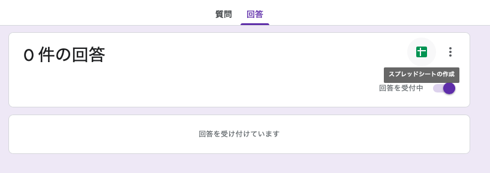
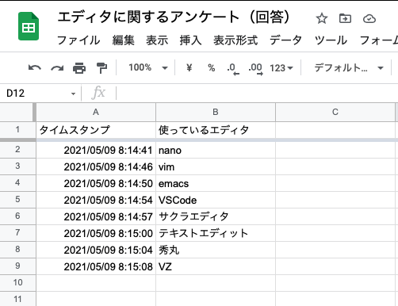
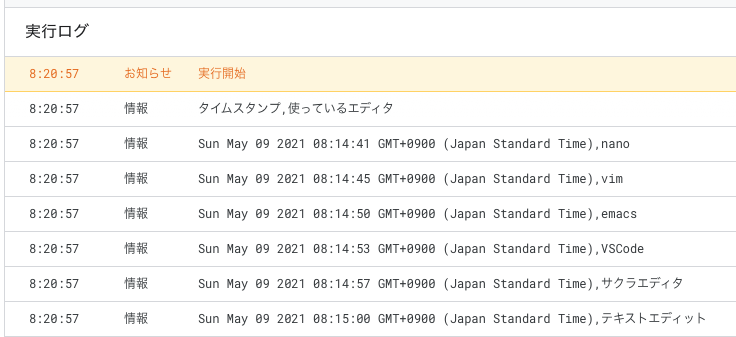
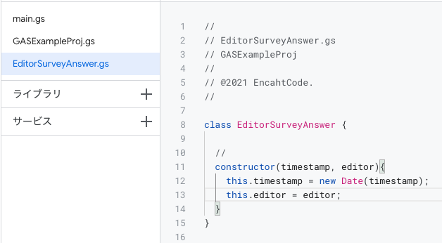
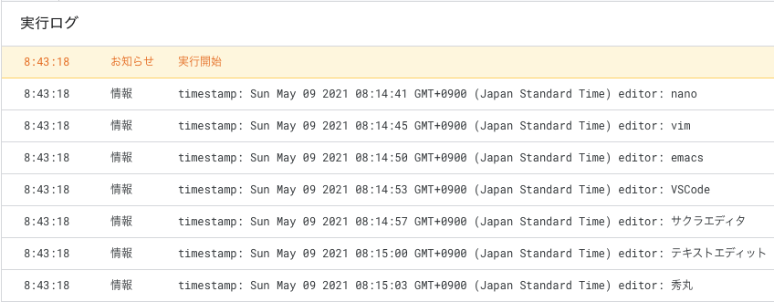

# スプレッドシートを編集する

[< Previous](05_EditForms.md) [Home](00_Indices.md) [Next >](07_Trigger.md)

## フォームの回答をGASから取得

前項で生成したフォームの回答をGASで取得する方法を考えてみます。  
Googleフォームの回答は自動でスプレッドシートに集計されるので、`SpreadSheetApp`経由で読み出すことができそうです。

## 集計シートを開く

フォームの編集メニューから 「回答」->「スプレッドシートの作成」をクリックすると  
集計用のシートが生成されます。

  

回答を追加するごとに新しい行が生成され、内容が記録されていきます。要はこれを取得できればよいわけです。

  

## スプレッドシートの内容を取得

Googleフォームの時と同様、スプレッドシートにも識別子が設定されています。回答シートのURLをコピーし、識別子を抽出します。

```
https://docs.google.com/spreadsheets/d/(この部分が識別子です)/edit
```

流れは`FormApp`の時とさほど変わりません。`openById`で開いて`getDataRange`,`getValues`で有効なデータが格納されている範囲を取得し、`forEach`で回しているだけです。

```js
// Application main
main(){
    const sheetID = "XXXXXX";
    const sheet = SpreadsheetApp.openById(sheetID);

    const sheetDataValues = sheet.getDataRange().getValues();
        sheetDataValues.forEach((dataValue)=>{
        console.log(dataValue.join(","));
    });
}
```

実行すると…

  

回答を取得することができました。

## 回答データクラスを作る

`getValues`は`Object[][]`を返すだけなので、そのまま処理するのは若干可読性が落ちる**気がします**。  
そこで、フォームの回答を表すクラス`EditorSurveyAnswer`を定義し、回答リストを`EditorSurveyAnswer[]`として持つように設計してみます。

  

ファイルを追加し…

```js
//
// EditorSurveyAnswer.gs
// GASExampleProj
//
// @2021 EnchantCode.
//

class EditorSurveyAnswer {

    //
    constructor(timestamp, editor){
        this.timestamp = new Date(timestamp);
        this.editor = editor;
    }
}
```

`main()`を修正します。

```js
// Application main
main(){
    const sheetID = "XXXXXX";
    const sheet = SpreadsheetApp.openById(sheetID);

    const sheetDataValues = sheet.getDataRange().getValues();
    sheetDataValues.shift(); // ヘッダ行
    const answers = sheetDataValues.map((dataValue) => {
        return new EditorSurveyAnswer(dataValue[0], dataValue[1]);
    });

    answers.forEach((answer) => {
        console.log(`timestamp: ${answer.timestamp} editor: ${answer.editor}`);
    });
}
```

実行すると…

  

表示内容は先ほどのものと変わらないように見えますが、コード的にはだいぶ読みやすくなったのではないでしょうか。  
`filter`等で絞り込む際も…

```js
const vimmerCount = answers.filter((answer)=>{
    return answer.editor == "vim";
}).length;
console.log(`${vimmerCount} users use vim!`);
```

このように簡潔に記述することができます。

[< Previous](05_EditForms.md) [Home](00_Indices.md) [Next >](07_Trigger.md)