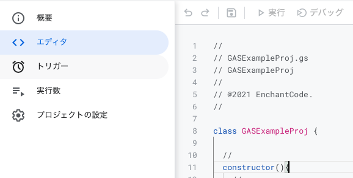
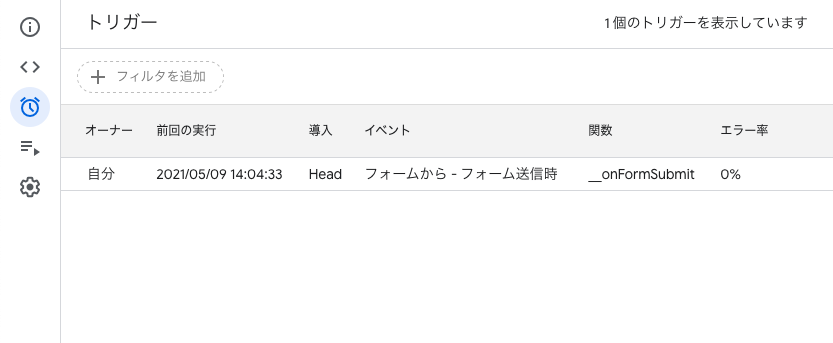
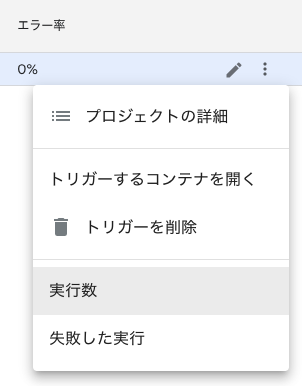
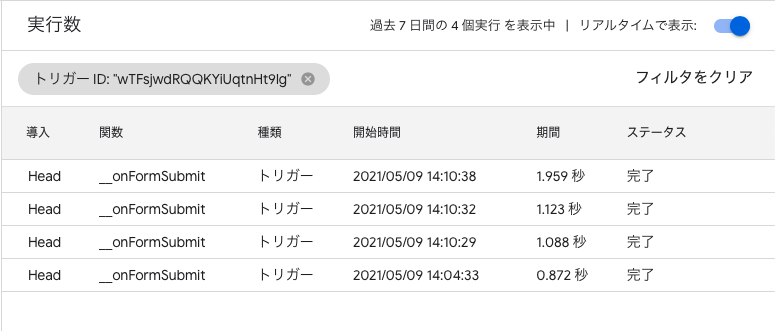
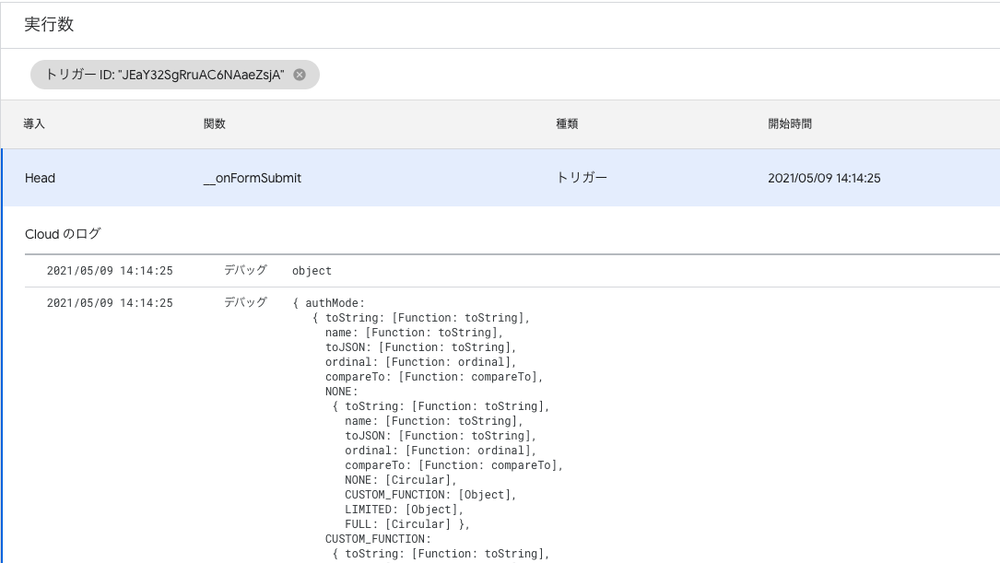
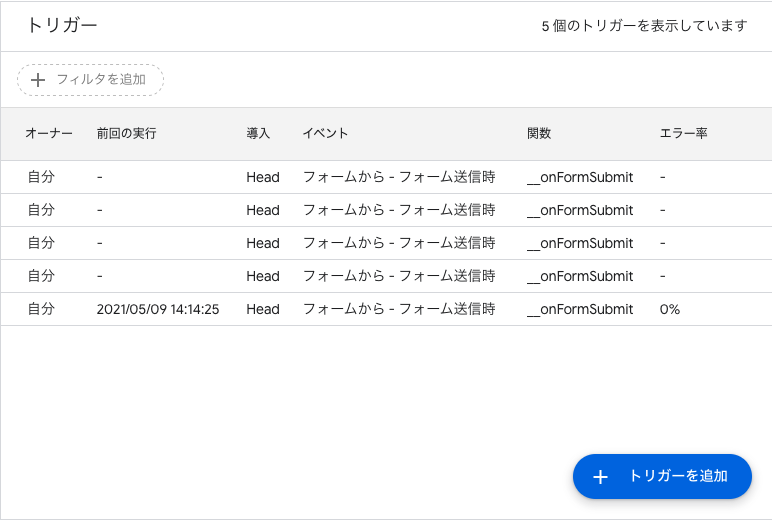

# トリガーによる自動化

[< Previous](06_EditSheet.md) [Home](00_Indices.md) [Next >](08_Trigger.md)

## GASの本領発揮

**お前自動化自動化言いながら今んとこ全部手動じゃねーか！** というツッコミが入りそうだったので、このあたりで自動化方面に進んでいきたいと思います。(ドキュメントやスライド等の制御も非常に面白いのですが、一旦飛ばします)  

## トリガーとは

GASには自動化のための仕組みとして「トリガー」が提供されています。トリガーを活用することで、GASの外側つまりユーザの操作や時間の経過に従って自動で関数を実行させることができます。

トリガーはGUIで設定することもできますが、本項ではコードベースで設定を行います。

## フォームに回答が追加されたら〇〇する

今回は、比較的デバッグが容易なGoogleフォームにトリガーを追加してみます。  
まずはトリガーに実行してもらう関数を用意します。`main.gs`に関数`__onFormSubmit`を追加しました。

```js
// On form submit
function __onFormSubmit(event){
    const application = new GASExampleProj();
    console.log(event);
}
```

次にトリガーを設定するための関数を書いていきます。`main.gs`に関数`__initTrigger`を追加します。

```js
function __initTrigger(){
    // フォームを取得し
    const formID = "XXXXXX";
    const form = FormApp.openById(formID);
    
    // トリガーを生成
    const trigger = ScriptApp.newTrigger("__onFormSubmit") // __onFormSubmitを実行
    .forForm(form) // フォームに対し
    .onFormSubmit(); // フォームが送信された時

    // 登録
    trigger.create();
}
```

実行対象の関数を`__initTrigger`に切り替え、「実行」をクリックします。左ペインから「トリガー」をクリックすると、フォーム送信時に発動するトリガーが登録されたことがわかります。

  



では実際に自動化されているかを確認してみましょう。フォームを開き、いくつか適当に回答していきます。  
エディタに戻り、右端のボタンから「実行数」をクリックすると、実行状況が確認できます。  

  

　
  

各行をクリックするとデバッグ出力(`console.log`や`Logger.log`の出力)が展開されます。今回は関数`__onFormSubmit`に渡されたトリガーの情報を直接`console.log`するようにしたので、トリガー実行時の情報がそのまま`object`となって渡っていることがわかります。

  

## トリガーの重複に注意

これで問題ない**ように見えるのですが、**このままだとちょっと厄介なことになります。`__initTrigger`を複数回実行してみると…

  

**エライことになってしまいます**。同じ起動条件のトリガーが重ねて生成されてしまうのです。  
複数回処理が走るだけなので問題ないこともありますが、処理がGAS内で完結しない(`MailApp`でメールを送信する、`SpreadSheetApp`にトリガーの実行履歴を書き込む 等々)場合はちょっと困ります。  

`ScriptApp.Trigger`同士の比較を行うことができればどうにか避けられそうなのですが、どうやらGAS上では**トリガーの生成と登録はワンセットになっている**ようです。  
なので`__initTrigger`は`main`や`__entryPoint`等から実行することはせず、GASのエディタ上のみで実行で見るようにしておいた方が良さそうです。  

(先頭に現在登録されているトリガーを全て削除する処理を挟むと事故った時のリカバリが容易かもしれません:)

```js
// 一回トリガーを全消し
ScriptApp.getProjectTriggers().forEach((trigger) => {
    ScriptApp.deleteTrigger(trigger);
});
```


[< Previous](06_EditSheet.md) [Home](00_Indices.md) [Next >](08_Trigger.md)
