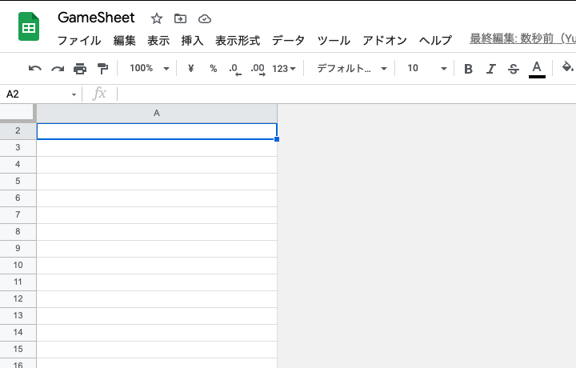
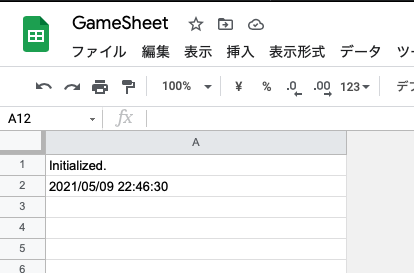
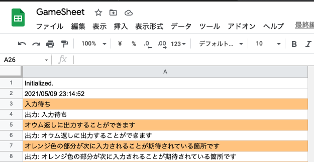

# スプレッドシートで数当てゲーム

[< Previous](07_Trigger.md) [Home](00_Indices.md) [Next >](08_NumGame_2.md)

## ゲームを作ろう

入力ができて、それに従ってある処理を行い、結果を入力した画面と同じところに表示する…  
ここだけ聞くと、 **あれ?スプレッドシートってゲームコンソールなんじゃね?** と思う方もいらっしゃるかと思います。  
**それは多分病気です。**

というわけで(強引)、第三章からはちょっとした応用としていくつか簡素なゲームを作ってみたいと思います。  
第一弾は「**数当てゲーム**」です。

## 構成

コンピュータが生成・決定したある範囲の整数を、ユーザが決められた回数入力して答えるだけの簡単なゲームです。    
これだけではゲームとして成立しないので、「間違った答えを入力すると "それより大きい(小さい)"というヒントを出す」というルールを追加します。  
例えば内部値が *65* だったら…

 - 入力: 90 出力: *too big*
 - 入力: 80 出力: *too big*
 - 入力: 60 出力: *too small*
 - 入力: 68 出力: *too big*
 - 入力: 64 出力: *too small*
 - 入力: 65 出力: *collect!*

のようなイメージです。ポケコンやBASIC、Scratchなどの入門として広く親しまれている例のアレです。

## ロジックを考える

ゲーム本体のロジックは正直考えるまでもないでしょう。ある値より大きいか小さいかによってSpreadSheetAppの関数をこねくり回すだけです。  
問題は「状態の保存」という点にあります。現在の解答となる数値、ゲームモード(入力を受け付けているのか、ゲームが開始しているのか、正解または不正解してゲームが終了しているのか)などをトリガー間で引き継ぐことはできないため、別の方法を考える必要が出てきます。  

これについては様々な方法があるのですが、今回は`PropertiesService`を使ってみたいと思います。  `PropertiesService`はkey-value形式で任意の値を保存できるので、今回のような小規模な値の保存には最適と言えるでしょう。

## 実装

では実装していきます。

### スプレッドシート整備・トリガ設定

まずは普通にスプレッドシートを作成します。初期状態では1000行×26列が設定されているのですが、今回はA列を残して全て削除します。さらにセルの横幅を広げ、テキストを左揃えにします。
  
これでスプレッドシート側の作業はひとまず完了です。識別子をどこかにメモしておいてください。

次に、GASに新しいトリガーを設定します。スプレッドシートの更新があるたびに`GASExampleProj::onSheetChange`が呼び出されるように設定していきます。

```js
function __initTrigger() {
    // 一回トリガーを全消し
    ScriptApp.getProjectTriggers().forEach((trigger) => {
        ScriptApp.deleteTrigger(trigger);
    });
    console.log("全てのトリガーが削除されました。");

    // スプレッドシートを指定してトリガー追加
    const sheetID = "XXXXXX";
    const sheet = SpreadsheetApp.openById(sheetID);

    ScriptApp.newTrigger("__onSheetEdit")
        .forSpreadsheet(sheet)
        .onEdit()
        .create();
}

// On sheet edit
function __onSheetEdit(event){
    const application = new GASExampleProj();
    application.onChangeSheet();
}
```

`GASExampleProj`に`onSheetChange`を追加します。以降はシートに変更が加わるたびにこの関数が実行されるようになります。

## 入出力コンソールの構成

次に、先ほど整備したスプレッドシートを入出力コンソールにしていきます。

まず、コンソールには 「**カーソル**」と「**入力状態**」という二つの状態を持たせることにします。  
GASからコンソールに書き込む際は現在のカーソルの位置を取得して書き込み、ユーザの入力を取得する際はカーソルをひとつ進めてそこのセルへの入力を待機する…というような設計でいきます。

```js
//
// Console.gs
// GASExampleProj
//
// @2021 EnchantCode.
//

class Console {

  /**
   * スプレッドシートを指定してコンソール生成
   * @param {SpreadsheetApp.Sheet} sheet - 対象のシート
   */
  constructor(sheet){
    this.kConsoleCursor = "CONSOLE_CURSOR";
    this.kConsoleMode = "CONSOLE_MODE";
    this.sheet = sheet;

    this.scriptProperties = PropertiesService.getScriptProperties();
    this.getCursor();
  }

  /**
   * 現在のカーソル位置に文字列を出力し、カーソルを進める
   * @module writeLine
   * @param {any} content - 表示内容
   */
  writeLine(content){
    const currentRange = this.getCursorRange();
    currentRange.setValue(content);
    this.addCursor(1);
  }

  /**
   * 現在のカーソル位置の文字列を取得する
   * @module readLine
   * @return {string} - カーソル位置の内容
   */
  readLine(){
    const currentange = this.getCursorRange();
    return currentange.getValue();
  }

  /**
   * 現在のカーソルが指すスプレッドシート上のRangeを返す
   * @module getCursorRepresentation
   * @param {number} column - 列名(default: 1)
   * @return {SpreadsheetApp.Range}
   */
  getCursorRange(column = 1){
    const currentCursor = this.getCursor();
    return this.sheet.getRange(currentCursor + 1, column); 
  }

  /**
   * カーソルを進める
   * @module addCursor
   * @param {number} add - 進める量(default: 1)
   * @return {number} - 進めた後の位置
   */
  addCursor(add = 1){
    const currentCursor = this.getCursor();
    this.setCursor(currentCursor + add);
    return this.getCursor();
  }

  /**
   * 現在のカーソル位置を取得
   * @module getCursor
   * @return {number}
   */
  getCursor(){
    const storedCursorValue = this.scriptProperties.getProperty(this.kConsoleCursor);
    if(storedCursorValue !== null){
      return Number(storedCursorValue);
    }else{
      this.setCursor(0);
      return 0;
    }
  }

  /**
   * カーソル位置を設定
   * @module getCursor
   * @param {number} cursor - 設定するカーソルの番号
   */
  setCursor(cursor){
    this.scriptProperties.setProperty(this.kConsoleCursor, cursor);
  }

}
```

長くなってしまったので説明は省きます。かなりコメントを振ってあるのでだいぶわかりやすくなっているはずです。~~コードが汚いのは私のスキル不足です。~~

さてさて使ってみましょう。

```js
/* GASExampleProj.gs */

  //
  constructor(){
    const consoleSheetID = "1g9a4XXeV-jiCxOTKy8zCY7qS9tNGOsywevnJphef_so";
    const consoleSheet = SpreadsheetApp.openById(consoleSheetID).getSheets()[0];
    this.console = new Console(consoleSheet);
  }

  // Application main
  main(){
    this.console.setCursor(0);
    this.console.writeLine("Initialized.");
    this.console.writeLine(new Date());
  }

  // change game console sheet
  onChangeSheet(){
  }
```

実行すると…

  

スプレッドシートが出力コンソールになりました。

このまま入力もいきましょう。(長くなりすぎるのでソースは省略します。)

  

完成です!これでひとまず入出力が自由にできるようになりました。

(長くなってしまったのでひとまず次のページに進みます。)

[< Previous](07_Trigger.md) [Home](00_Indices.md) [Next >](08_NumGame_2.md)
